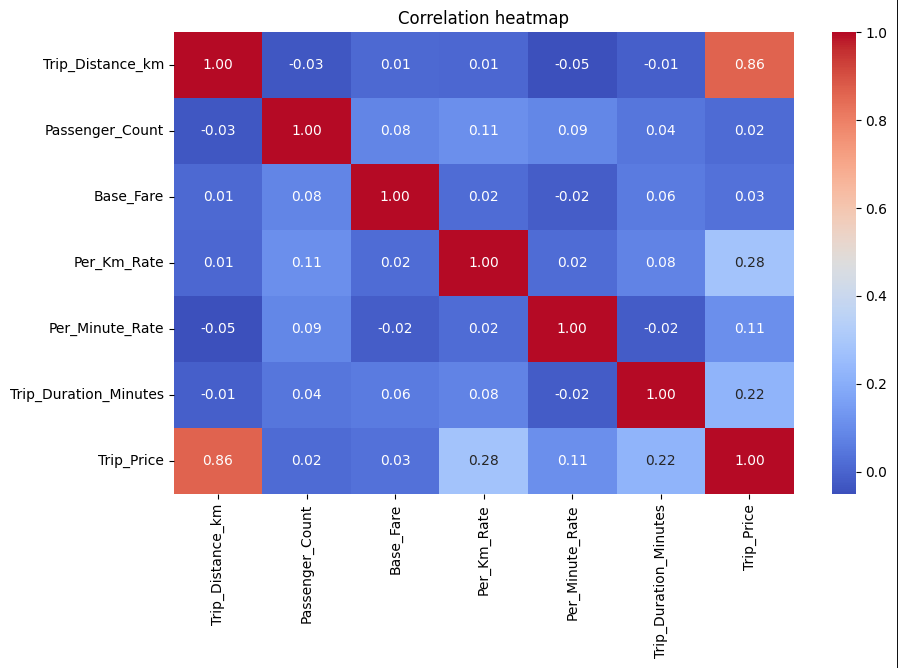
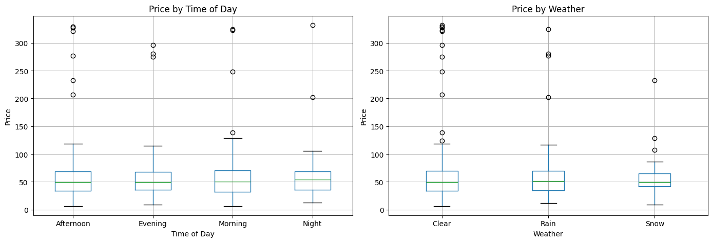
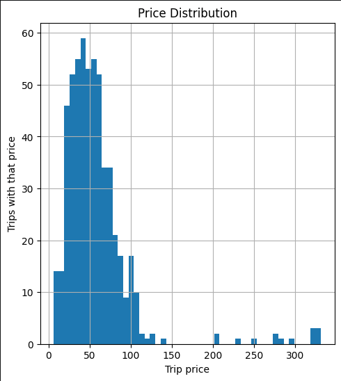
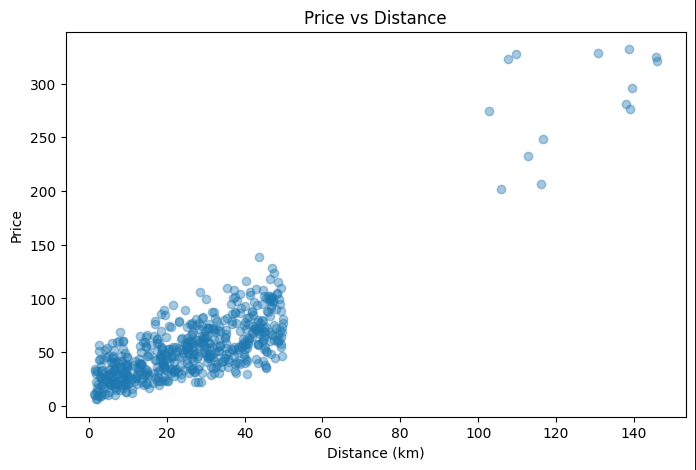

# Taxi Price Predictor

A full-stack ML application that predicts taxi prices based on distance, passengers, traffic and weather. Enter a start and end location, and the app geocodes the addresses, calculates the distance, and returns a predicted price.

## 


## Tech Stack
- **Frontend** — Streamlit + Folium maps
- **Backend** — FastAPI
- **Model** — Random Forest (scikit-learn)
- **Experiment Tracking** — MLflow
- **Containerization** — Docker + Docker Compose
- **CI/CD** — GitHub Actions

## Screensshots


## Model Performance

| Model | MAE | R² |
|-------|-----|-----|
| Linear Regression | 5.60 kr | 0.91 |
| **Random Forest** | **3.94 kr** | **0.95** |

## Model Selection
Two models were evaluated using MLflow experiment tracking Random Forest (MAE: 3.94, R²: 0.95) 
and Linear Regression (MAE: 5.60, R²: 0.91). Despite Random Forest having slightly better metrics, 
Linear Regression was chosen for production as it produced more realistic price predictions 
closer to real-world taxi prices, with no significant difference in accuracy.

## Exploratory Data Analysis

Correlation

Trip_Distance_km has by far the strongest correlation with Trip_Price (0.86), meaning distance is the dominant factor in determining the fare. Per_Km_Rate shows a moderate correlation (0.28), followed by Trip_Duration_Minutes (0.22) and Per_Minute_Rate (0.11). Features like Passenger_Count and Base_Fare have almost no correlation with price, suggesting they contribute very little to the final fare.



Price by Time of Day & Weather

The median price is consistent across all times of day (Afternoon, Evening, Morning, Night), hovering around 50. The spread and outliers are similar across all categories, suggesting that time of day has little impact on price. Similarly, weather conditions (Clear, Rain, Snow) show no meaningful difference in median price or distribution, indicating that weather alone does not significantly affect the fare in this dataset.



Price Distribution

The majority of trips are priced between 20 and 80, with the distribution peaking around 40 - 60. The distribution is right-skewed, with a small number of high-value outliers ranging up to ~332. This suggests that most trips are short to medium distance, with occasional long-distance trips driving up the tail.



Price vs Distance

The scatter plot confirms the strong correlation (0.86) seen in the heatmap. There is a clear positive linear relationship between distance and price for trips up to ~50 km. Notably, there is a visible gap in the data between ~50 - 100 km, followed by a cluster of high-price trips at 100 - 150 km. This could indicate two distinct trip types in the dataset — local city trips and longer intercity trips.



## Run with Docker

```bash
git clone https://github.com/LeoLindqvist123/taxi_prediction_fullstack_Leo_Lindqvist.git
cd taxi_prediction_fullstack_Leo_Lindqvist
docker compose up --build
```

- Frontend: http://localhost:8501
- API docs: http://localhost:8000/docs

## Run locally

```bash
uv venv
uv pip install fastapi uvicorn streamlit pandas scikit-learn joblib requests folium streamlit-folium geopy mlflow
```

```bash
# Terminal 1
uvicorn src.taxipred.backend.api:app --reload

# Terminal 2
streamlit run src/taxipred/frontend/app.py
```

## Notes
Parts of the frontend and geocoding logic were developed with the assistance of AI tools 
(ChatGPT/Claude) to better understand and implement new concepts.

## Author
Leo Lindqvist Kröhnert