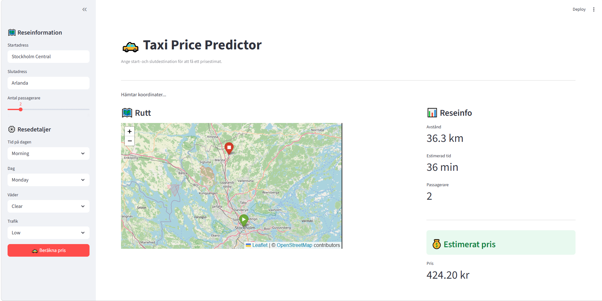
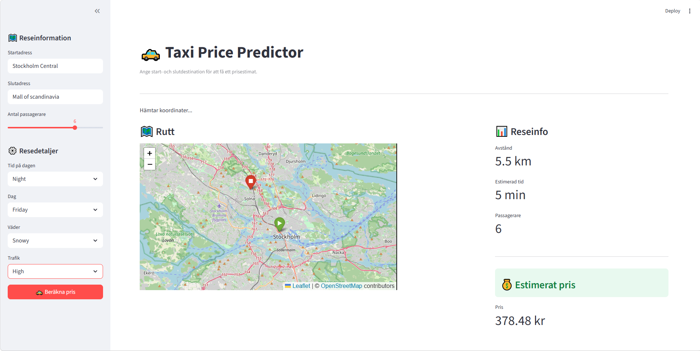

# Taxi Price Predictor

A full-stack ML application that predicts taxi prices based on distance, passengers, traffic and weather. Enter a start and end location, and the app geocodes the addresses, calculates the distance, and returns a predicted price.

## 


## Tech Stack
- **Frontend** — Streamlit + Folium maps
- **Backend** — FastAPI
- **Model** — Random Forest (scikit-learn)
- **Experiment Tracking** — MLflow
- **Containerization** — Docker + Docker Compose
- **CI/CD** — GitHub Actions

## Screensshots




## Model Performance

| Model | MAE | R² |
|-------|-----|-----|
| Linear Regression | 5.60 kr | 0.91 |
| **Random Forest** | **3.94 kr** | **0.95** |

## Model Selection
Two models were evaluated using MLflow experiment tracking Random Forest (MAE: 3.94, R²: 0.95) 
and Linear Regression (MAE: 5.60, R²: 0.91). Despite Random Forest having slightly better metrics, 
Linear Regression was chosen for production as it produced more realistic price predictions 
closer to real-world taxi prices, with no significant difference in accuracy.

## Run with Docker

```bash
git clone https://github.com/LeoLindqvist123/taxi_prediction_fullstack_Leo_Lindqvist.git
cd taxi_prediction_fullstack_Leo_Lindqvist
docker compose up --build
```

- Frontend: http://localhost:8501
- API docs: http://localhost:8000/docs

## Run locally

```bash
uv venv
uv pip install fastapi uvicorn streamlit pandas scikit-learn joblib requests folium streamlit-folium geopy mlflow
```

```bash
# Terminal 1
uvicorn src.taxipred.backend.api:app --reload

# Terminal 2
streamlit run src/taxipred/frontend/app.py
```

## Notes
Parts of the frontend and geocoding logic were developed with the assistance of AI tools 
(ChatGPT/Claude) to better understand and implement new concepts.

## Author
Leo Lindqvist